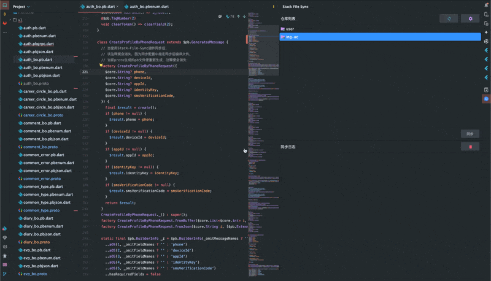

# Stack File Sync

<p align="center">
  
</p>

Stack File Sync is a comprehensive solution for synchronizing files and code snippets between multiple projects. It provides both an IntelliJ IDEA plugin and a powerful command-line tool for flexible file synchronization across development teams.

## 🎯 Two Ways to Use Stack File Sync

### 🔌 IntelliJ IDEA Plugin

A powerful IDE plugin designed for seamless file synchronization within your development environment.

### 💻 Command Line Tool (CLI)

A standalone command-line tool for team-wide repository synchronization with interactive terminal UI.

**📖 [View CLI Documentation →](./stack-sync-cli/README.md)**



## Key Features

### IntelliJ Plugin Features

- 🔄 Real-time file synchronization
- 🕒 Configurable auto-sync intervals
- 📁 Multi-repository support
- 🔒 Secure file backup
- ⚡ High-performance file transfer
- 🛠 Customizable sync rules
- 📊 Detailed sync logs

### CLI Tool Features

- 🎨 Interactive terminal UI with file selection
- 📦 Multi-repository management from single config
- 👀 File watching with auto-sync mode
- ⚡ Fast & lightweight single binary
- 🔒 SSH & HTTPS authentication support
- 💾 Optional backup before sync operations
- 🌐 Team-wide synchronization capabilities

## Installation

### IntelliJ IDEA Plugin

#### From JetBrains Marketplace

1. Open the plugin marketplace in IntelliJ IDEA
2. Search for "Stack File Sync"
3. Click the Install button

#### Manual Installation

1. Download the latest plugin release package (.zip)
2. In IntelliJ IDEA, go to `Settings/Preferences -> Plugins -> ⚙️ -> Install Plugin from Disk`
3. Select the downloaded plugin package to install

### CLI Tool

For CLI installation and usage, please refer to the [CLI Documentation](./stack-sync-cli/README.md).

**Quick CLI Install:**

```bash
# Using Homebrew (macOS)
brew tap aa12gq/stack-sync-cli
brew install stack-sync

# Using install script
curl -fsSL https://raw.githubusercontent.com/stackfilesync/stack-sync-cli/main/scripts/install.sh | bash

# Or using Go
go install github.com/stackfilesync/stack-sync-cli/cmd/stack-sync@latest
```

## Quick Start

### IntelliJ Plugin Quick Start

1. After installation, open the configuration panel via `Tools -> Stack File Sync -> Configure`
2. Add a new sync repository
3. Configure sync rules and auto-sync options
4. Click the sync button in the toolbar to start syncing

### CLI Tool Quick Start

1. **Initialize Configuration**

   ```bash
   stack-sync init
   ```

2. **Add Repository**

   ```bash
   stack-sync add
   ```

3. **Start Syncing**

   ```bash
   stack-sync sync <repository-name>
   ```

For detailed CLI usage, see the [CLI Documentation](./stack-sync-cli/README.md).

## Configuration

### IntelliJ Plugin Configuration

#### Repository Settings

- **Name**: Unique identifier for the repository
- **Local Path**: Local folder path to sync
- **Remote Path**: Remote sync target path
- **Sync Rules**: File include/exclude patterns
- **Auto Sync**: Enable/disable auto sync feature

#### Auto Sync Settings

- **Enable Status**: Turn auto sync on/off
- **Sync Interval**: Set auto sync time interval (seconds)
- **Sync Mode**: Choose one-way or two-way sync

### CLI Tool Configuration

The CLI tool uses a YAML configuration file for managing repositories and sync settings. For detailed configuration options, see the [CLI Documentation](./stack-sync-cli/README.md).

## Usage Examples

### IntelliJ Plugin Usage

#### Manual Sync

1. Click the sync button in the toolbar
2. Select the repository to sync
3. Wait for the sync to complete

#### Auto Sync

1. Enable auto sync in repository settings
2. Set the sync interval
3. The plugin will automatically sync according to the set interval

### CLI Tool Usage

#### Interactive Sync

```bash
# Sync with interactive file selection
stack-sync sync <repository-name>
```

#### Watch Mode

```bash
# Enable file watching for auto-sync
stack-sync watch <repository-name>
```

#### List Repositories

```bash
# List all configured repositories
stack-sync list
```

For more CLI examples, see the [CLI Documentation](./stack-sync-cli/README.md).

## Performance Optimization

### IntelliJ Plugin

- Uses incremental sync to reduce data transfer
- Multi-threaded parallel processing for better sync speed
- Smart file caching mechanism
- Low memory footprint design

### CLI Tool Performance

- Single binary with no runtime dependencies
- Efficient file watching with minimal resource usage
- Parallel processing for multiple repository operations
- Optimized Git operations for faster sync

## FAQ

**Q: How to resolve sync conflicts?**
A: Both the plugin and CLI tool automatically detect conflicts and provide resolution options. You can choose to keep the local version or use the remote version.

**Q: What sync modes are supported?**
A: Currently supports one-way sync mode for both plugin and CLI.

**Q: Can I use both the plugin and CLI tool together?**
A: Yes! The plugin is great for IDE-integrated workflows, while the CLI tool is perfect for team-wide synchronization and automation scripts.

**Q: How do I migrate from plugin to CLI?**
A: You can export your plugin configuration and import it into the CLI tool. See the [CLI Documentation](./stack-sync-cli/README.md) for details.

## Contributing

We welcome community contributions! If you'd like to contribute:

1. Fork the project
2. Create your feature branch (`git checkout -b feature/AmazingFeature`)
3. Commit your changes (`git commit -m 'Add some AmazingFeature'`)
4. Push to the branch (`git push origin feature/AmazingFeature`)
5. Open a Pull Request

## Version History

- v1.1.0 (2025-10-20)

  - Added CLI tool with interactive terminal UI
  - Enhanced file selection with keyboard navigation
  - Multi-repository management support
  - File watching and auto-sync capabilities

- v1.0.0 (2024-02-06)
  - Initial release
  - Basic sync functionality
  - Auto sync support

## License

This project is licensed under the MIT License - see the [LICENSE](LICENSE) file for details

## Contact

- Project Homepage: [GitHub](https://github.com/aa12gq/stack-file-sync-intellij)
- Issue Tracker: [Issue Tracker](https://github.com/aa12gq/stack-file-sync-intellij/issues)
- Email: [aa12gq@gmail.com](mailto:aa12gq@gmail.com)

## Acknowledgments

Thanks to all the developers who have contributed to this project!

---

<p align="center">Made with ❤️ by Stack File Sync Team</p>
